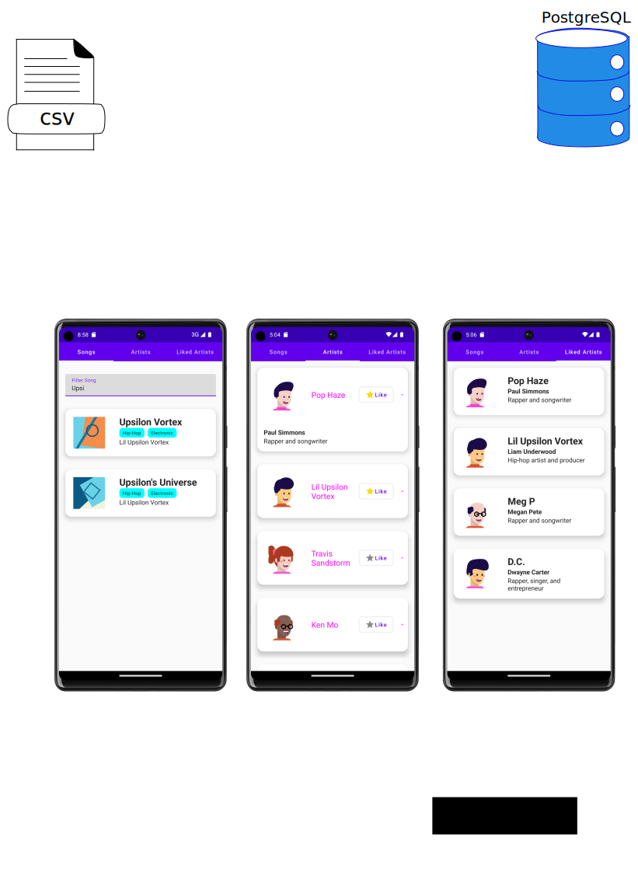

# Microproject Music App

## Description

This project is a music app that allows users to view and listen to songs by their favorite artists, and discover new music based on genres. The app has three main entities: songs, artists, and genres.

## Application Structure

    

## Features

- **Songs view**:
  The "Songs view" displays all songs in a visually appealing way by listing them on cards, with genres displayed as chips and album covers generated using [dicebear](https://www.dicebear.com/).

- **Artist view**:
  The "Artist view" displays all artist, with extendable cards that display information about the artist and allows to like the artist.
  The artist avatars are generated using [dicebear](https://www.dicebear.com/).

- **Liked artists view**:
  The "Liked artists view" displays all liked artists information about the artist
  The artist avatars are generated using [dicebear](https://www.dicebear.com/).

    
    
    

## Technologies Used

### Backend

- Quarkus (Kotlin programming language)
- reads data from csv files
- REST API endpoints for communication with frontend

### Frontend

- Jetpack Compose (Android UI toolkit)
- Retrofit (HTTP client library for Android)
- RoomDB (Android database library)
- [dicebear](https://www.dicebear.com/) to display album covers and artist icons
